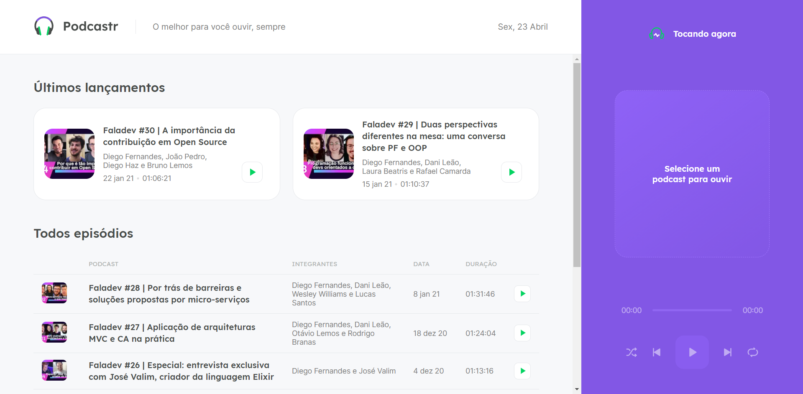
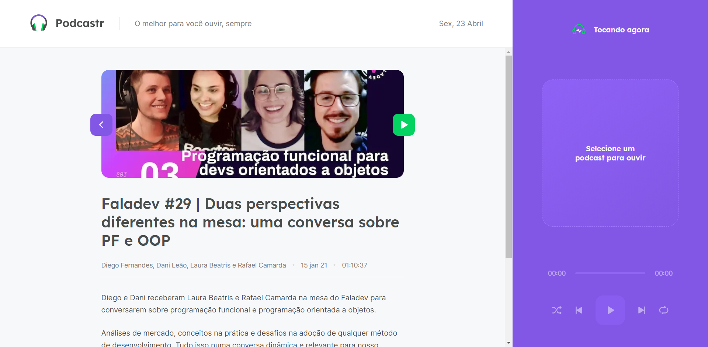

<h1 align="center"> Podcastr </h1>

## Descrição do Projeto
<p>Desenvolvimento da frontend de um site de podcast, acompanhando o evento NLW 5 da RocketSeat</p>

<h4 align="center"> 
	🚧  Aula 3 🚀 Em construção...  🚧
</h4>
 
Tabela de conteúdos
=================
<!--ts-->
   * [Sobre](#descrição-do-projeto)
   * [Como usar](#como-usar)
     * [Pré-Requisitos](#pré-requisitos)
     * [Rodando a aplicação](#-rodando-a-aplicação)
   * [Tecnologias](#-tecnologias)
   * [Demonstração](#demonstração)
   * [Autor](#autor)
   * [Licença](#liçenca)
<!--te-->
 
## Como Usar

### Pré-requisitos

Antes de começar, você vai precisar ter instalado em sua máquina as seguintes ferramentas:
[Git](https://git-scm.com), [Node.js](https://nodejs.org/en/). 
Além disto é bom ter um editor para trabalhar com o código como [VSCode](https://code.visualstudio.com/)

### 🎲 Rodando a aplicação

```bash
# Clone este repositório
$ git clone <https://github.com/tgmarinho/ItaloRez/Podcastr/>

# Acesse a pasta do projeto no terminal/cmd
$ cd Podecastr

# Instale as dependências
$ npm install

# Inicialize o servidor JSON de testes
$ yarn server

# Execute a aplicação em modo de desenvolvimento
$ yarn dev

# A aplicação inciará na porta:3000 - acesse <http://localhost:3000>
```

## 🛠 Tecnologias

As seguintes ferramentas foram usadas na construção do projeto:

- [Node.js](https://nodejs.org/en/)
- [React](https://pt-br.reactjs.org/)
- [TypeScript](https://www.typescriptlang.org/)
- [Next.js](https://nextjs.org/)
- [Sass](https://sass-lang.com/)

## Demonstração

<h1 align="center">
  
</h1>

<h1 align="center">
  
</h1>

## Autor

 </img>
 <br/>
 <sub><b>Ítalo de Rezende</b></sub>🚀


Feito por Ítalo de Rezende 👋🏽 Entre em contato!


[](https://www.linkedin.com/in/%C3%ADtalo-rezende-60a5571b2/) 

[](mailto:italo.rezende@gec.inatel.br)


## Licença


